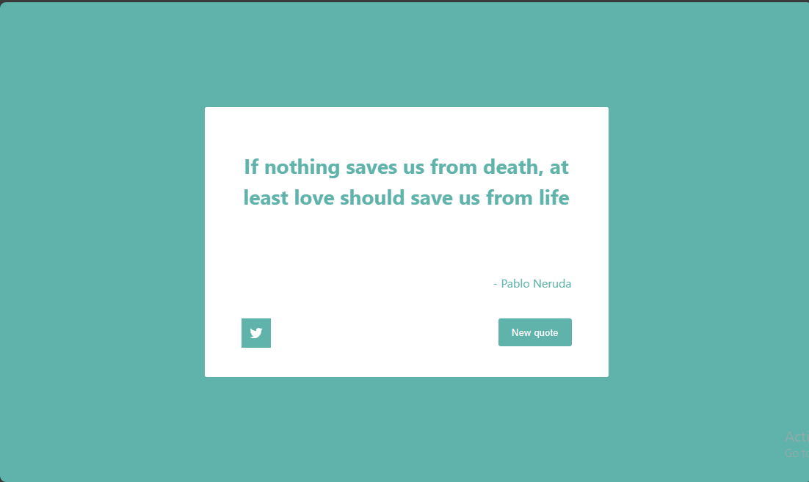

# Random Quote Machine

## Features

- Display a random quote on the screen.
- Fetch quotes from an external API.
- Share the current quote on Twitter.

## Api used

The project fetches quotes from the https://rapidapi.com/martin.svoboda/api/quotes15/ api.

## Technologies used

- React
- Typescript
- axios

## installation

- clone the repository
- change directory
- npm install
- npm run dev

### Author

- luka kilasonia
- github: https://github.com/kila21
- linkedin: https://www.linkedin.com/in/luka-kilasonia-937a9a211/
